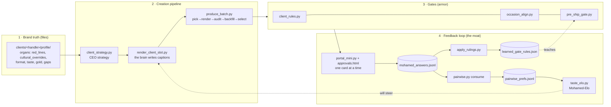
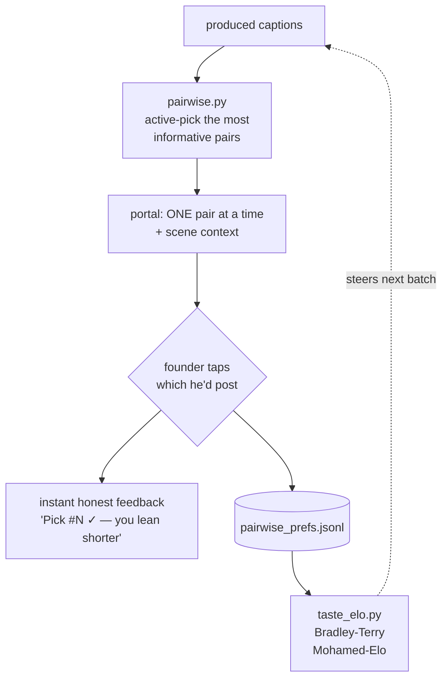

# HOW IT WORKS — ogz-knowledge

The mental model a developer needs to take this system over. Read this once, top to bottom, and
you'll understand every moving part. Then `HANDOVER.md` for setup + known issues, `README.md` for
the original build briefing, and `docs/` for deep dives.

---

## The system in one breath

It's a **file-first knowledge base** that powers two things: a **creation pipeline** (writes
Instagram posts for Saudi brands) and a **taste-calibration loop** (learns the founder's eye so the
*machine* decides what's good, not a person). **Gates** enforce quality at the source, a **portal**
collects the founder's judgments, and **daemons** keep it running 24/7.

The moat isn't the code — it's **the founder's captured taste** + the **cultural correctness**. The
code is the machine that captures and applies them.

---

## The big picture

The two dotted lines are the **learning loop closing**: the founder's rejections become gate rules
(`learned_gate_rules.json` → `pre_ship_gate.py`, **live**), and his A/B picks become a taste model
(`taste_elo.json` → should steer `render_client_slot.py`, **pending — the next milestone**).

---

## The five things to understand

### A. File-first data model
Files in git are the **source of truth**; Postgres (`13_database/`) is an *index over* the files,
never the reverse. Knowledge is organized in **numbered layers** (`00_`–`22_`, see the map below).
Per-client truth lives in `clients/<handle>/profile/` as **organs** — small JSON files, each a
confirmed fact about the brand (its red lines, cultural overrides, format, voice, gold examples).
Every record carries **provenance** (source, date, confirmer, confidence, scope) and a **ULID**.
Schemas in `12_data_shapes/` are the **frozen v1 contracts** — don't change them without sign-off.

### B. The creation pipeline
A brand's organs feed a CEO strategy (`client_strategy.py` → `strategy_brief.json`), which feeds the
**brain** (`render_client_slot.py`) — the brain writes captions *from inside the scene*, fed the
client's confirmed organs (never a template), with a **DOORS** mechanism forcing structural variety
so 3 options can't collapse into one shape. `produce_batch.py` runs it autonomously:
pick a slot → render → audit → backfill failures → select. Output: `clients/<handle>/posts/*.json`.
**Rule: the system produces. Humans fix the machine and judge — never hand-write a caption.**

### C. The calibration loop = the moat
The original judge scored captions 0–10 and agreed with the founder only **47%** (below chance — it
clustered everything at ~6.5). So scoring was replaced with **A-vs-B preference**:

`taste_elo.py` is **pure numpy, no LLM, no key**. Honesty rules are baked in (`held_out_live_pct`,
not the degenerate mixed number — see code comments). This is the single most important subsystem:
it turns the founder's gut into a reusable signal.

### D. The gates (armor)
Every post passes gates **at the source** before it can reach the founder:
- `client_rules.py` — the client's organs as hard rules (no faces/family/real-names if forbidden,
  cloud-kitchen format, cross-brand bleed, English-in-Arabic, caption-length drift ceiling).
- `occasion_align.py` — the caption must match the slot's occasion (no Eid line on a normal day).
- `pre_ship_gate.py` — consumes the founder's **learned rulings** (rejections become bans).
- `make_sure.py` — the system-wide heartbeat: run it first, always; it's the single "is everything
  alive" check, and it surfaces write-only organs + severed wires.

The design law behind the gates: **a writer needs a reader** (every value written must be consumed)
and **refuse, don't warn** (a gate exits non-zero; it never ships bad work with a note).

### E. The automation (how it runs 24/7)
Daemons (macOS launchd on the Mac Mini — *not* in the repo, see HANDOVER §3):
- **enricher** (`scripts/ogz_enricher.py`) — analytics + **auto-commits the repo hourly**.
- **the orchestra** (`~/.claude/scheduled-tasks/rabie-orchestra/`) — every 30 min: health-check →
  route the founder's taps → work one step from `data/backlog.json` → test → log. See
  `docs/ORCHESTRA_v2.md`.
- **cloudflare tunnel** — exposes the portal at `brain.ogzstudios.com`.

---

## The life of one post (end-to-end)

1. Brand is extracted → `clients/<h>/profile/` organs (the confirmed truth).
2. `client_strategy.py` derives the year/strategy from the organs.
3. `produce_batch.py` picks a slot → `render_client_slot.py` writes 3 caption options from the organs.
4. Gates run: `client_rules` + `occasion_align` + `pre_ship_gate`. Failures → backfill (re-render).
5. Survivors are staged to the portal (`queue_decision.py` → `data/decision_queue.json`).
6. Founder opens `brain.ogzstudios.com`, sees **one pair at a time** with scene context, taps.
7. Tap → `mohamed_answers.jsonl` → `apply_rulings.py` (rulings → gate rules) + `pairwise.py consume`
   (→ `taste_elo.py` recomputes his taste) → instant feedback on the tap.
8. Next batch is better: the gates carry his new rules; (soon) the brain is steered by his Elo.

---

## Key directories

| Layer | Holds |
|---|---|
| `00_start_here`, `00_system` | orientation + system config |
| `01_how_to_decide`, `07_how_to_plan`, `09_how_to_run` | decision/planning/runbook docs |
| `02_what_to_build` | the **chain library** (88+ visual-prompt chains) |
| `04_saudi_rules`, `15_cultural_specs` | the **cultural moat** (forbidden lists, 80-field spec) |
| `05_sector_defaults`, `06_saudi_calendar` | sector baselines + Hijri/occasion calendar |
| `10_agent_brains`, `20_cd_brains` | the C-suite + 5 CD creative-director methodologies |
| `11_who_to_learn_from` | 6,888 benchmark observations + account patterns |
| `12_data_shapes` | **frozen v1 JSON schemas** (the contracts) |
| `13_database` | SQL migrations (the index over the files) |
| `14_brand_fingerprint`, `16_character_library` | brand DNA + reusable characters |
| `clients/`, `data/`, `scripts/`, `api/` | live client data, runtime state, code, the portal |

---

## Why it's built this way (design decisions)

- **File-first, Postgres-as-index** — the knowledge must be diffable, reviewable, and survive any
  runtime. Files win; the DB is a cache.
- **Pairwise, not scoring** — one person's taste is captured far more reliably by A-vs-B choices
  than by absolute stars (the 47% scorer proved scoring fails here).
- **The system produces, humans judge** — prevents the team from hand-curating outputs and fooling
  themselves; what the founder sees must come from a real run.
- **Gates refuse, don't warn** — a quality system that ships with a warning is worse than none.
- **Staged maturity** — Stage 0 deterministic → 1 shadow → 2 selective → 3 managed. Trust is earned.

---

## Where to start reading (the 5 highest-signal files)

1. `scripts/make_sure.py` — run it; it shows you what the system considers "alive."
2. `scripts/render_client_slot.py` — the brain; how a caption is actually made.
3. `scripts/pairwise.py` + `scripts/taste_elo.py` — the moat (calibration).
4. `scripts/client_rules.py` — how the brand's truth becomes hard rules.
5. `api/portal_mini.py` — the feedback surface the founder taps on.

Known issues + setup: see **HANDOVER.md**. The improvement queue: `data/backlog.json`.
